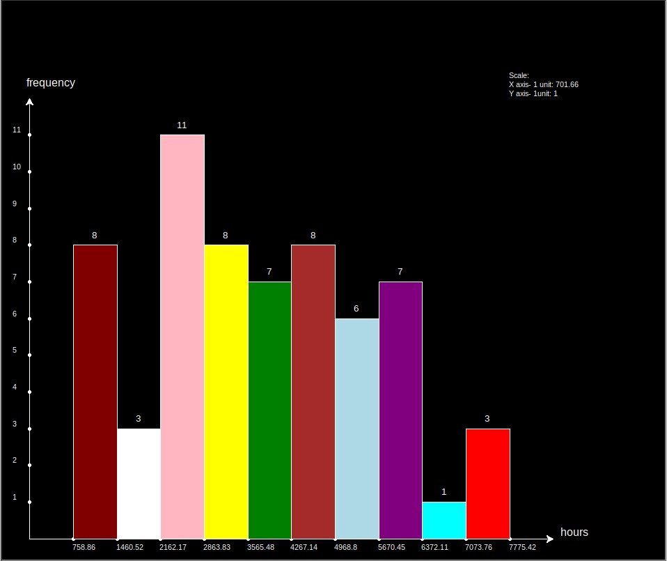

# Histogram generator

Python code to generate a histogram from a text file input of line separated values

## Input format

Text file of values to be graph, values to be separated by new line character
Name of the x value being graphed

```
...
3467.17
6290.46
5167.65
2524.21
1184.41
7234.96
5315.43
1772.85
1259.86
2601.38
4375.89
5529.74
5818.43
...
```

## Running the code

```bash
python Bar_Chart.py <path to text file> <name of the x axis>
```

Example

```bash
python Bar_Chart.py input/hours.txt hours
```

## Output

Graph generated by running the above in the terminal



## Things i learnt

1. How to use the turtle library in python
2. take in command line inputs
